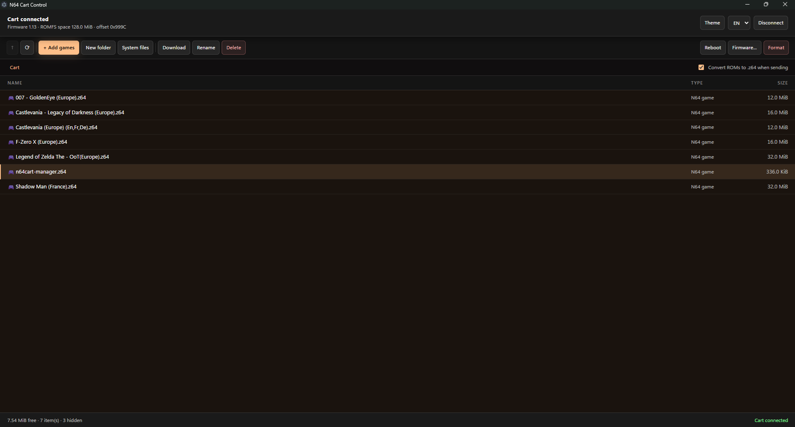

# N64 Cart Control



**N64 Cart Control** is a desktop application developed with Electron for managing and administering an N64 flash cartridge from a computer.

The application provides a graphical interface for browsing the cartridge file system, managing games and files, and performing various cartridge system operations.

## Features

- Detect connected N64 cartridges
- Display cartridge information
- Display firmware version
- Display ROMFS capacity and available space
- Manage N64 games
- Add ROMs to the cartridge
- Automatically convert ROMs to `.z64`
- Create folders
- Rename files and folders
- Delete files and folders
- Download files from the cartridge
- Manage system files
- Reboot the cartridge
- Firmware management
- Format the cartridge
- Browse the cartridge file system
- Dark interface
- Theme support
- Multilingual interface

## Interface

N64 Cart Control provides a file-manager-style interface for easily managing the contents of the cartridge.

The application displays information such as:

- Cartridge connection status
- Firmware version
- ROMFS capacity
- ROMFS offset
- Files stored on the cartridge
- File sizes
- Available storage space

## ROM Management

When adding a game, N64 Cart Control can automatically convert the ROM to the `.z64` format before transferring it to the cartridge.

This allows compatible ROMs to be transferred directly without requiring manual conversion beforehand.

## Technologies

- Electron
- Node.js
- JavaScript
- HTML
- CSS

## Requirements

### Application (N64 Cart Control)

| Software | Minimum version | Notes |
| --- | --- | --- |
| Node.js | **22** | `node-gyp` 13 requires `^22 \|\| ^24 \|\| >=26`. Older releases fail during the native build with `ReferenceError: File is not defined`. |
| Python | 3.8 | Used by `node-gyp` to generate the build files. |
| C/C++ toolchain | see notes | Windows: Visual Studio 2022 or newer with *Desktop development with C++*. Linux: `build-essential` |
| libusb | 1.0 | Linux and macOS only, headers plus `pkg-config`. On Windows the vendored sources are compiled by the addon itself. |

Install the system dependencies:

```bash
# Debian / Ubuntu
curl -fsSL https://deb.nodesource.com/setup_22.x | sudo -E bash -
sudo apt install -y nodejs build-essential pkg-config libusb-1.0-0-dev python3
# also required for the .deb target
sudo apt install -y fakeroot dpkg-dev

# Fedora
sudo dnf install nodejs gcc-c++ pkgconf-pkg-config libusbx-devel python3

# Arch
sudo pacman -S nodejs npm base-devel pkgconf libusb python

# macOS
brew install node@22 libusb pkg-config
xcode-select --install
```

### Firmware toolchain

Downloaded into `SDK/` by `Scripts/get-pico-sdk.ps1` / `get-pico-sdk.sh`, and pulled in automatically by the firmware build script when missing. Nothing has to be installed system-wide.

| Component | Version |
| --- | --- |
| Pico SDK | 2.3.1 |
| Arm GNU toolchain | 15.2.Rel1 (13.2.Rel1 on Intel macOS) |
| CMake | 4.3.4 |
| Ninja | 1.13.2 |
| picotool | 2.3.1 |
| Python | 3.8 or newer |

### Manager ROM toolchain

Downloaded into `SDK/` by `Scripts/get-libdragon.ps1` / `get-libdragon.sh`.

| Component | Version |
| --- | --- |
| libdragon | `preview` branch |
| mips64-elf GCC | prebuilt `toolchain-continuous-prerelease` release |
| GNU make | 4.x |
| xxd | any, a Python 3 replacement is generated when it is missing |

On Windows the script also installs a portable GCC (winlibs 16.2.0) and BusyBox-w32, so no MSYS2, WSL, Docker or Git installation is needed.

### Host utilities

`curl` (or `wget`), `tar` and `unzip` are used by the download scripts. `git` is optional: when it is absent the sources are fetched as archives, and the firmware is simply built without a version hash.

## Build Scripts

The `Scripts` directory contains the scripts required to set up the development environment, download dependencies and build the project.

### SDK and Libraries

#### Pico SDK

The Pico SDK is required to build the firmware for Raspberry Pi Pico / RP2040 based hardware.

## Project Status

The project is currently under active development.

Additional features and improved compatibility with N64 cartridges will be added progressively.

## License

See the `LICENSE` file for more information.